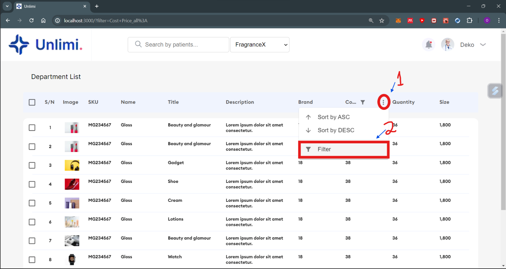

## Blutech Solutions Skill Assessment Submission

## Prerequisites to run
Node.js and npm (Node Package Manager)

## Running the project
clone this repository by running `git clone https://github.com/Tomiwa-S/blutech.git`
or simply download and unzip

navigate into the repo master directory

install the dependencies, run `npm install`

to start the project run  `npm run dev`
and navigate to your localhost, usually port 3000 - localhost:3000

A demo of the site is available at [here](https://blutech-gamma.vercel.app/)
However, API calls aren't granted because the API isn't HTTPs secure

## Other details
To apply a filter, hover hover a column, select the filter option and apply the filter you need as illustrated in the diagram below

the search and filter queries are updated in the url and can be shared with other.

## Contact details
name: Oluwatomiwa Olu-Ajayi
email: timmeysam@gmail.com
phone: 08145938130

